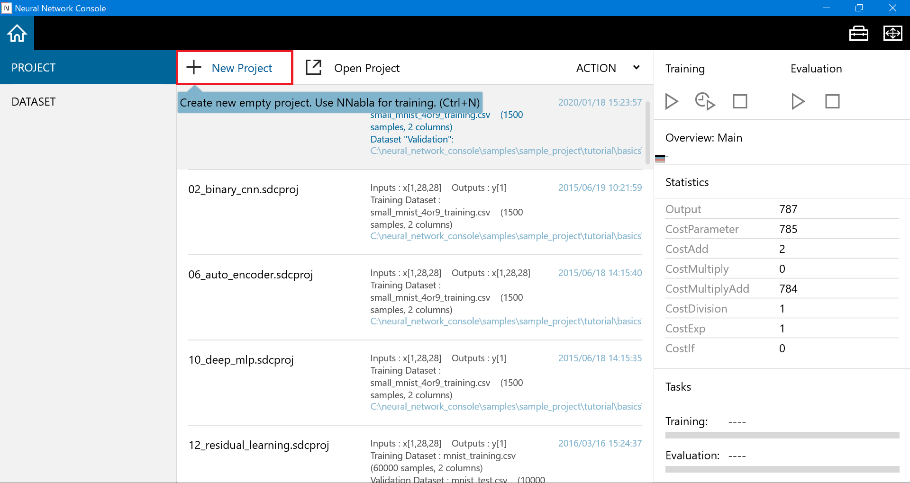
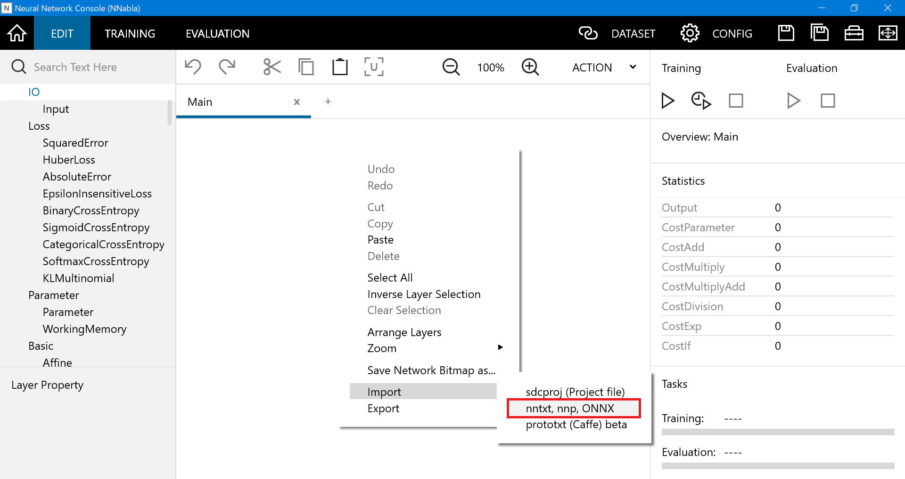
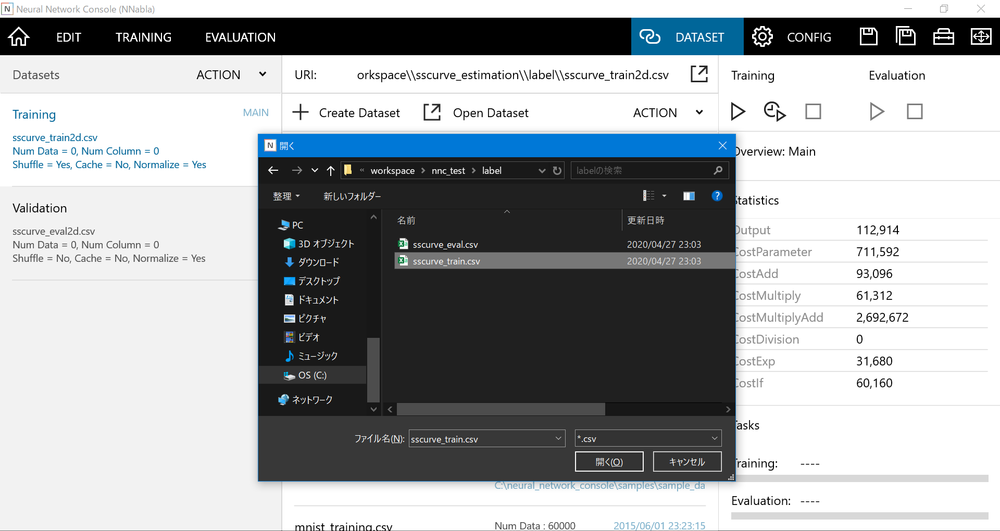
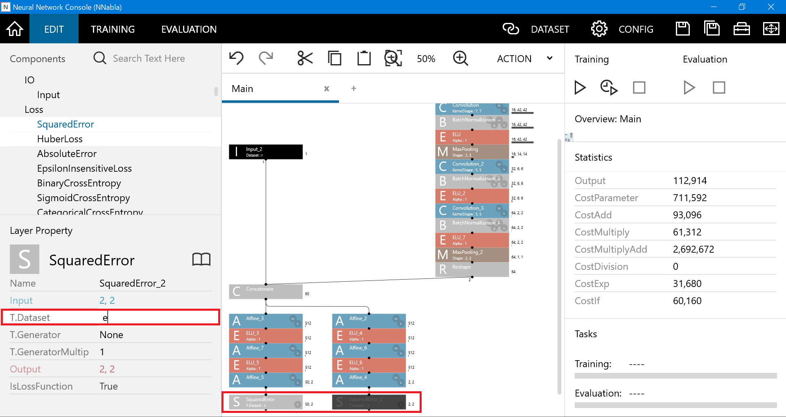
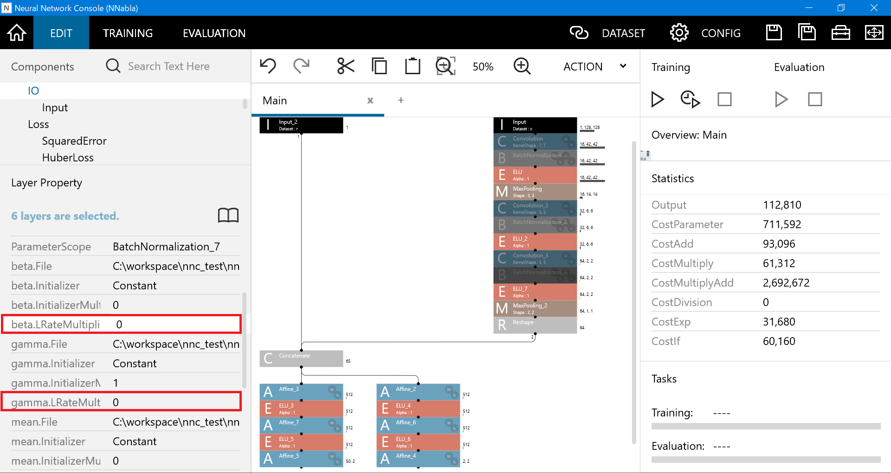
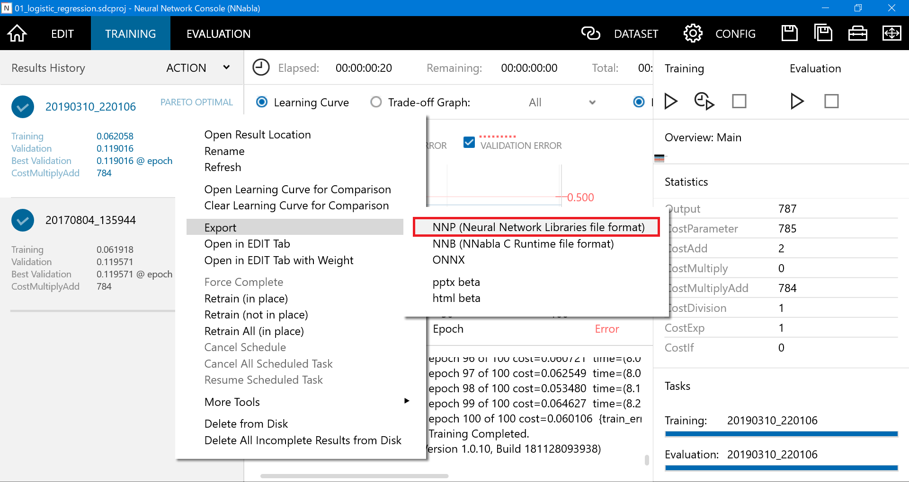
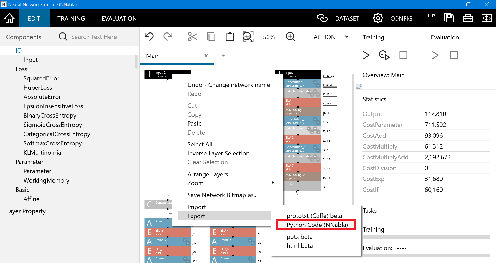

# Deep Neural Network-based Numerical Material Test
-----
<a id="1"></a>
## Description
The Deep Neural Network-based Numerical Material Test (DNN-NMT) project provides the neural network (NN) structure (named DNN-2D), the training parameters and the datasets for estimating biaxial stress-strain curves of aluminum alloy sheets from a pole figure image of crystallographic texture. The NN provided in this project can be used on <a href="https://dl.sony.com/ja/app/">Neural Network Console</a> (NNC) developed by Sony Network Communications Inc.<br>

## Publications
1. A. Yamanaka, R. Kamijyo, K. Koenuma, I. Watanabe and T. Kuwabara, "Deep neural network approach to estimate biaxial stress-strain curves of sheet metals", Materials & Design, (2020), in print. <a href="https://doi.org/10.1016/j.matdes.2020.108970">https://doi.org/10.1016/j.matdes.2020.108970</a>

2. K. Koenuma, A. Yamanaka, I. Watanabe and T. Kuwabara, "Estimation of texture-dependent stress－strain curve and r-value of aluminum alloy sheet using deep learning", Materials Transactions, (2020), in print. 

3. K. Koenuma, A. Yamanaka, I. Watanabe and T. Kuwabara, "Estimation of texture-dependent stress－strain curve and r-value of aluminum alloy sheet using deep learning", Journal of Japan Society for Technology of Plasticity, Vol. 61 No. 709 (2020), pp. 48-55. (in Japanese) <a href="https://doi.org/10.9773/sosei.61.48">doi.org/10.9773/sosei.61.48</a>

## Contens
1. [Description](#1)
1. [Requirements](#2)
1. [Demonstration](#3)
1. [Usage](#4)
    1. [Importing trained NN to NNC](#5)
    1. [Training NN](#6)
    1. [Re-training NN](#7)
    1. [Exporting trained NN](#8)
    1. [Estimation of biaxial stress-strain curves using trained NN](#9)
1. [Licence](#10)
1. [Developers](#11)

<a id="2"></a>
## Requirements
- Neural Network Console can be used on Windows 10. Please see: https://dl.sony.com/app/
- Installation of Neural Network Console can be found: https://dl.sony.com/app/
- The trained NN provided in this project has been tested using Python3.6.
- If you want to try [Demonstration](#3), you need to do the following procedures:

1.  You need to install the following libraries:
```bash
pip install numpy matplotlib scipy
pip install nnabla
```

<a id="3"></a>
## Demonstration
- If you try this demonstration on your computer, please see [Requirements](#2).
- You can run the trained NN using the following command and estimate biaxial stress-strain curves.
```bash
python drawSScurve.py
```

<a id="4"></a>
## Usage
0. Overall usege of NNC please see: https://support.dl.sony.com/docs/

<a id="5"></a>
#### Importing the trained NN to NNC
- You can use the trained NN structure and the training parameters provided in this project by importing "nntxt" or "nnp" file to NNC: 

1. Launch NNC and select "New Project". <br>


2. Open "EDIT" tab and select "Import → nntxt, nnp, ONNX" by right-clicking a network graph.


3. Read "nntxt" file if you want to use the trained NN structure. Note that if you want to use both the trained NN structure and the training parameters, read "nnp" file. <br>
ex) ./nnc_proj/net.nntxt

4. If the name of imported NN is "MainRuntime", modify the name as "Main". <br>

<a id="6"></a>
#### Training NN
- If you want to train the NN using the datasets provided in this project, you need to do the following procedures:

1. You can download the datasets from <a href="http://web.tuat.ac.jp/~yamanaka/opendata.html">Yamanaka research group@TUAT</a>.
1. Save the datasets in the directory named "./trainingdata/".
1. Run "create_dataset.py" by using the following command, then you can create csv files which can be used in NNC.
- CSV file for training is saved in "./label/sscurve_train.csv".
- CSV file for validation is saved in "./label/sscurve_eval.csv".
```bash
python create_dataset.py
```

1. Open "DATASET" tab and select "Open Dataset". Then, read the above CSV files.

<!-- TODO: 図 -->

1. Open "EDIT" tab. Then, you need to connect the loss function, for example "SquerdError", to the Affine layers (Affine_4 and Affine_5).
1. Change from "y" to s" in the property (T.Dataset) of loss function for Affine_4. On the other hand, for Affine_5, change from "y" to "e".  

<!-- TODO: 図 -->

1. Open "CONFIG" tab and enter the values of Max Epoch and Batch Size. For example, you can use Max Epoch = 100 and Batch Size = 8.
1. Select the optimizing algorithm in "Optimizer" shown in "CONFIG" tab.
1. Start the training of NN by pushing "F5 button".


<a id="7"></a>
#### Re-training NN
- If you want to re-train the NN using your datasets, please do the following procedures:

1. Open "EDIT" tab and select the parameters which you want to fix. For example, you can select convolution and BatchNormalization layers.
1. Enter 0 (zero) to "...LRateMultiplier" shown in the property of the selected layers. This prevents to change the parameters used in the trained NN.


1. Prepare your dataset by referring to <a href="https://doi.org/10.1016/j.matdes.2020.108970">our paper</a> and "create_dataset.py". 
1. Load your datasets from "DATASET" tab and start training.
1. Please see https://support.dl.sony.com/docs/ for the training procedure.

<a id="8"></a>
#### Exporting trained NN
- You can export the trained NN structure and the trained parameters by following procedures:

1. Open "TRAINING" tab and select "Export" by right-clicking the Results History. Then, you can select the nnp file. <br>
ex) Export → NNP (Neural Network Libraries file format)


1. For the case shown in the above figure, the exported file is saved in the training result folder and the file is named as "model.nnp”.


<a id="9"></a>
#### Estimation of biaxial stress-strain curves using the trained NN
- You can estimate the biaxial stress-strain curves using the trained NN by following procedures:

1. Open "EDIT" tab and select the trained NN structure by right-clicking.
1. Select "Export → Python Code (NNabla)" and, then, Python code for the trained NN is copied to Clipboad. Note that you need to delete the loss function layers.


3. Create a python script named as "[project_name_of_NNC].py" in the directory "./nnc_proj" and paste the python code copied in the Step 2.
4. Edit "dnn2d.py" provided in this project so that you can use the NN named "[project_name_of_NNC].py".
```python
from nnc_proj.model import network  # modify here
nn.clear_parameters()
nn.parameter.load_parameters('./nnc_proj/model.nnp')  # modify here
```

1. Run "drawSScurve.py" and then you obtain the estimated biaxial stress-strain curves.

<a id="10"></a>
## License
BSD License (3-clause BSD License)

<a id="11"></a>
## Author
[Yamanaka Research Group @ TUAT](http://web.tuat.ac.jp/~yamanaka/)
